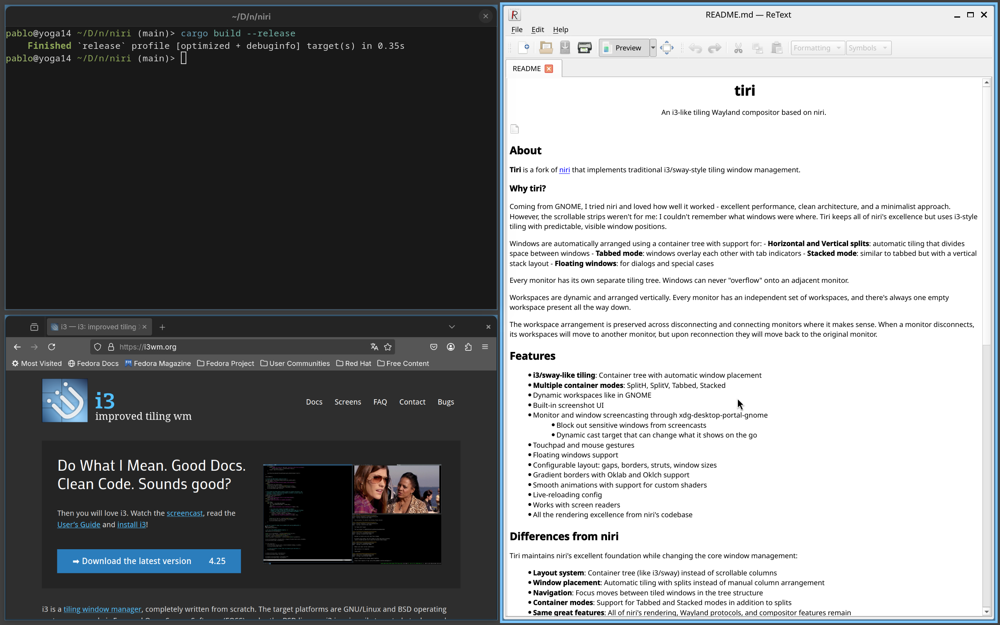

<h1 align="center"></h1>

An i3-like tiling Wayland compositor based on niri.

## About

**Tiri** is a fork of [niri](https://github.com/YaLTeR/niri) that implements traditional i3/sway-style tiling window management.

### Why tiri?

Coming from GNOME, I tried niri and loved how well it worked - excellent performance, clean architecture, and a minimalist approach. However, the scrollable strips weren't for me: I couldn't remember what windows were where. Tiri keeps all of niri's excellence but uses i3-style tiling with predictable, visible window positions.

Windows are automatically arranged using a container tree with support for:
- **Horizontal and Vertical splits**: automatic tiling that divides space between windows
- **Tabbed mode**: windows overlay each other with tab indicators
- **Stacked mode**: similar to tabbed but with a vertical stack layout
- **Floating windows**: for dialogs and special cases

Every monitor has its own separate tiling tree.
Windows can never "overflow" onto an adjacent monitor.

Workspaces are dynamic and arranged vertically.
Every monitor has an independent set of workspaces, and there's always one empty workspace present all the way down.

The workspace arrangement is preserved across disconnecting and connecting monitors where it makes sense.
When a monitor disconnects, its workspaces will move to another monitor, but upon reconnection they will move back to the original monitor.

## Features

- **i3/sway-like tiling**: Container tree with automatic window placement
- **Multiple container modes**: SplitH, SplitV, Tabbed, Stacked
- Dynamic workspaces like in GNOME
- Built-in screenshot UI
- Monitor and window screencasting through xdg-desktop-portal-gnome
    - Block out sensitive windows from screencasts
    - Dynamic cast target that can change what it shows on the go
- Touchpad and mouse gestures
- Floating windows support
- Configurable layout: gaps, borders, struts, window sizes
- Gradient borders with Oklab and Oklch support
- Smooth animations with support for custom shaders
- Live-reloading config
- Works with screen readers
- All the rendering excellence from niri's codebase

## Differences from niri

Tiri maintains niri's excellent foundation while changing the core window management:

- **Layout system**: Container tree (like i3/sway) instead of scrollable columns
- **Window placement**: Automatic tiling with splits instead of manual column arrangement
- **Navigation**: Focus moves between tiled windows in the tree structure
- **Container modes**: Support for Tabbed and Stacked modes in addition to splits
- **Same great features**: All of niri's rendering, Wayland protocols, and compositor features remain

## Status

Tiri is in active development. It builds on niri's stable foundation and is being refined for day-to-day use with i3-style tiling.

Being a fork of niri means tiri inherits:
- Mature Wayland protocol support
- Excellent rendering performance
- Multi-monitor handling
- All the compositor infrastructure

Have your [waybar]s and [fuzzel]s ready: tiri is not a complete desktop environment, just like i3/sway.

Here are some points you may have questions about:

- **Multi-monitor**: yes, a core part of the design from the very start. Mixed DPI works.
- **Fractional scaling**: yes, plus all niri UI stays pixel-perfect.
- **NVIDIA**: seems to work fine.
- **Floating windows**: yes, starting from niri 25.01.
- **Input devices**: niri supports tablets, touchpads, and touchscreens.
You can map the tablet to a specific monitor, or use [OpenTabletDriver].
We have touchpad gestures, but no touchscreen gestures yet.
- **Wlr protocols**: yes, we have most of the important ones like layer-shell, gamma-control, screencopy.
You can check on [wayland.app](https://wayland.app) at the bottom of each protocol's page.
- **Performance**: while I run niri on beefy machines, I try to stay conscious of performance.
I've seen someone use it fine on an Eee PC 900 from 2008, of all things.
- **Xwayland**: [integrated](https://yalter.github.io/niri/Xwayland.html#using-xwayland-satellite) via xwayland-satellite starting from niri 25.08.

## Credits and Acknowledgments

Tiri is built on top of [niri](https://github.com/YaLTeR/niri) by Ivan Molodetskikh (YaLTeR). All of niri's excellent architecture, Wayland protocol implementations, rendering pipeline, and compositor features are the foundation of this project.

If you want to learn more about the underlying technology, check out these niri resources:

- [niri: Making a Wayland compositor in Rust](https://youtu.be/Kmz8ODolnDg?list=PLRdS-n5seLRqrmWDQY4KDqtRMfIwU0U3T) - Talk about niri's internals
- [A tour of the niri scrolling-tiling Wayland compositor](https://lwn.net/Articles/1025866/) - LWN article about niri

## Contributing

Contributions to tiri are welcome! This is an independent fork focused on i3-style tiling.
See [CONTRIBUTING.md](CONTRIBUTING.md) for guidelines.

## Inspiration

Tiri is inspired by [i3](https://i3wm.org/) and [sway](https://swaywm.org/), the excellent tiling window managers that pioneered the container tree approach.

The project is built on [niri](https://github.com/YaLTeR/niri)'s foundation, which provides world-class Wayland compositor infrastructure.

## Related Projects

Other tiling window managers and compositors:

- [i3](https://i3wm.org/): The original tiling WM for X11
- [sway](https://swaywm.org/): i3-compatible tiling Wayland compositor
- [niri](https://github.com/YaLTeR/niri): The scrollable-tiling Wayland compositor this is based on
- [Hyprland](https://hyprland.org/): Dynamic tiling Wayland compositor

## License

Tiri is licensed under GPL-3.0-or-later, the same as niri.

[PaperWM]: https://github.com/paperwm/PaperWM
[waybar]: https://github.com/Alexays/Waybar
[fuzzel]: https://codeberg.org/dnkl/fuzzel
[awesome-niri]: https://github.com/Vortriz/awesome-niri
[karousel]: https://github.com/peterfajdiga/karousel
[papersway]: https://spwhitton.name/tech/code/papersway/
[hyprscrolling]: https://github.com/hyprwm/hyprland-plugins/tree/main/hyprscrolling
[hyprslidr]: https://gitlab.com/magus/hyprslidr
[PaperWM.spoon]: https://github.com/mogenson/PaperWM.spoon
[Matrix channel]: https://matrix.to/#/#niri:matrix.org
[OpenTabletDriver]: https://opentabletdriver.net/
