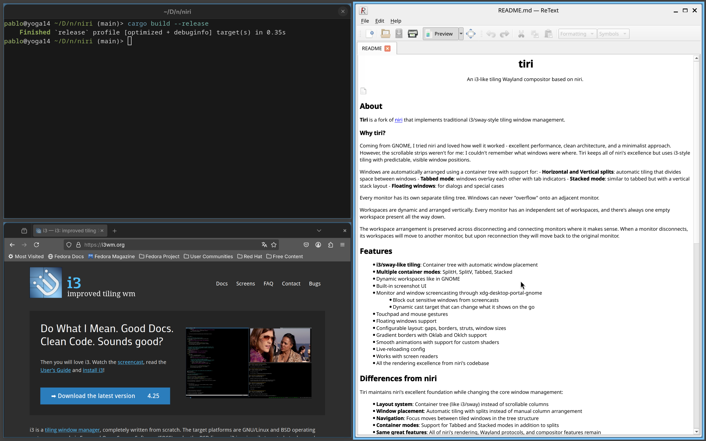

<h1 align="center">
  
</h1>

<p align="center">
  <strong>An i3/sway-like tiling Wayland compositor built from niri.</strong>
</p>

<p align="center">
  <a href="https://github.com/pablocpas/tiri/releases"></a>
  <a href="https://aur.archlinux.org/packages/tiri"></a>
  <a href="https://copr.fedorainfracloud.org/coprs/pablocpas/tiri/"></a>
  <a href="LICENSE"></a>
</p>

<p align="center">
  <a href="https://pablocpas.github.io/tiri/Getting-Started.html">Getting Started</a>
  ·
  <a href="https://pablocpas.github.io/tiri/Configuration:-Introduction.html">Configuration</a>
  ·
  <a href="https://github.com/pablocpas/tiri/releases">Releases</a>
  ·
  <a href="https://github.com/YaLTeR/niri">niri</a>
</p>



## About

**Tiri** is a fork of [niri](https://github.com/YaLTeR/niri) that keeps niri's Wayland compositor foundation and replaces the scrollable layout with traditional i3/sway-style tiling.

Windows live in a container tree: split horizontally, split vertically, tab them, stack them, or float them when the window calls for it. Each monitor owns its own workspace stack and tiling tree, so windows stay visible and predictable instead of flowing into another output.

Tiri is for people who like i3/sway's direct spatial model, but want it on top of niri's rendering, protocol support, animations, screencasting, gestures, and multi-monitor infrastructure.

## Install

Fedora:

```sh
sudo dnf copr enable pablocpas/tiri
sudo dnf install tiri
```

Arch Linux:

```sh
paru -S tiri
```

Nix:

```sh
nix profile install github:pablocpas/tiri
```

Debian/Ubuntu:

Download the `.deb` from the [latest release](https://github.com/pablocpas/tiri/releases/latest).

After installing, choose **Tiri** in your display manager, or run `tiri-session` from a TTY.

## Highlights

- **i3/sway-like tiling** with a real container tree.
- **Split, tabbed, stacked, and floating** container modes.
- **Independent monitor trees**: windows do not overflow into another monitor.
- **Dynamic vertical workspaces** with an always-empty workspace at the end.
- **Live-reloading configuration** in KDL.
- **Screenshot UI and screencasting** through xdg-desktop-portal-gnome.
- **Sensitive-window blocking** for screencasts.
- **Touchpad and mouse gestures** inherited from niri.
- **Configurable gaps, borders, struts, and window sizes**.
- **Gradient borders, animations, and custom shaders**.
- **Accessibility support** through the same base as niri.

## Tiri vs niri

| Area | niri | tiri |
| --- | --- | --- |
| Core layout | Scrollable columns | i3/sway-style container tree |
| Window placement | Manual column workflow | Automatic tiling splits |
| Spatial model | Infinite horizontal strip per workspace | Visible tree per workspace |
| Container modes | Columns and tabs | SplitH, SplitV, tabbed, stacked, floating |
| Foundation | Wayland compositor built in Rust | niri foundation with tiling semantics |

Tiri intentionally does not try to be a full desktop environment. Bring your bar, launcher, notification daemon, lock screen, wallpaper tool, and portal setup, just like you would for i3 or sway.

<!--
## Video Demo

Add a short demo here once there is a representative recording that shows the
tiling workflow, tabbed and stacked containers, multi-monitor behavior, and the
default session experience.
-->

## Status

Tiri is in active development and is being refined for daily i3-like use. It inherits a mature compositor base from niri, including rendering, input, screencasting, protocol support, and multi-monitor handling.

Things that are already first-class:

- Multi-monitor layouts, including mixed DPI.
- Fractional scaling with pixel-perfect compositor UI.
- Floating windows for dialogs and special cases.
- Xwayland through [xwayland-satellite](https://github.com/Supreeeme/xwayland-satellite).
- Wlr protocols such as layer-shell, gamma-control, and screencopy.
- Tablets, touchpads, and touchscreens.

## Packaging

Current distribution paths:

- Fedora: [COPR `pablocpas/tiri`](https://copr.fedorainfracloud.org/coprs/pablocpas/tiri/).
- Arch: [`tiri`](https://aur.archlinux.org/packages/tiri) on AUR.
- Nix: flake package at `github:pablocpas/tiri`.
- Debian/Ubuntu: `.deb` assets on GitHub Releases.

Packagers should read [Packaging tiri](https://pablocpas.github.io/tiri/Packaging-tiri.html). Release tarballs include a matching vendored dependency archive for offline Rust builds.

## Credits

Tiri is built on top of [niri](https://github.com/YaLTeR/niri) by Ivan Molodetskikh (YaLTeR). The rendering pipeline, Wayland protocol work, compositor architecture, and much of the surrounding documentation come from niri's excellent foundation.

Useful niri resources:

- [niri: Making a Wayland compositor in Rust](https://youtu.be/Kmz8ODolnDg?list=PLRdS-n5seLRqrmWDQY4KDqtRMfIwU0U3T)
- [A tour of the niri scrolling-tiling Wayland compositor](https://lwn.net/Articles/1025866/)

## Contributing

Contributions are welcome, especially around i3/sway behavior parity, layout correctness, testing, documentation, packaging, and real-world bug reports.

See [CONTRIBUTING.md](CONTRIBUTING.md) and the [Getting Started](https://pablocpas.github.io/tiri/Getting-Started.html) docs.

## License

Tiri is licensed under GPL-3.0-or-later.
